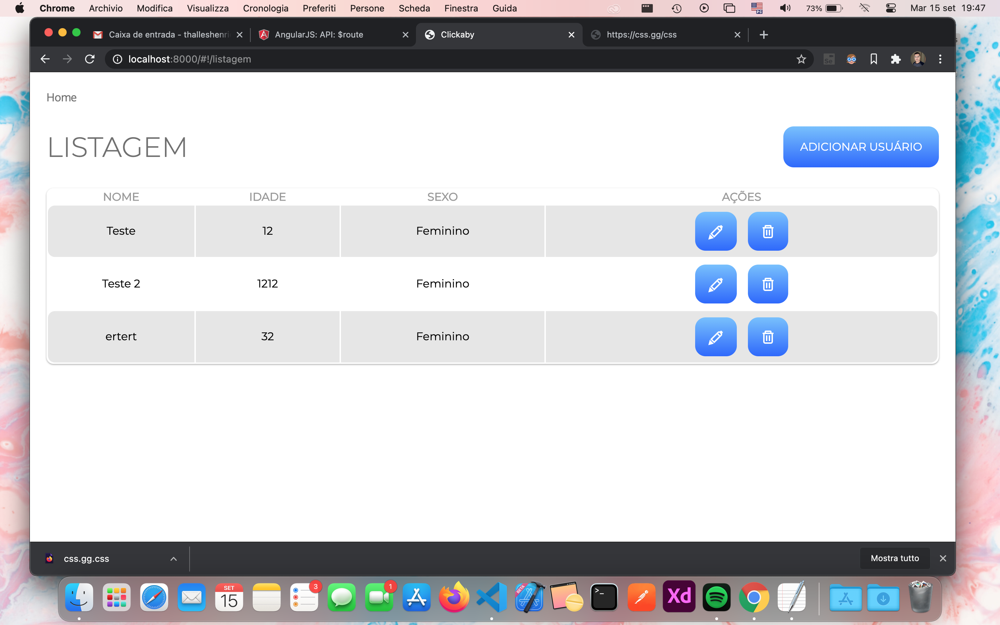

# Desafio MarkNet

### Requisitos (Runtime):

- NodeJS
- AngularJS (forkado de https://github.com/angular/angular-seed)

### Requisitos (Development):

- Live Sass Compiler (Visual Studio Code) para o pré-processador de CSS

## Instruções

- Instalar as dependências com `npm install`
- Executar a aplicação com `npm start`
